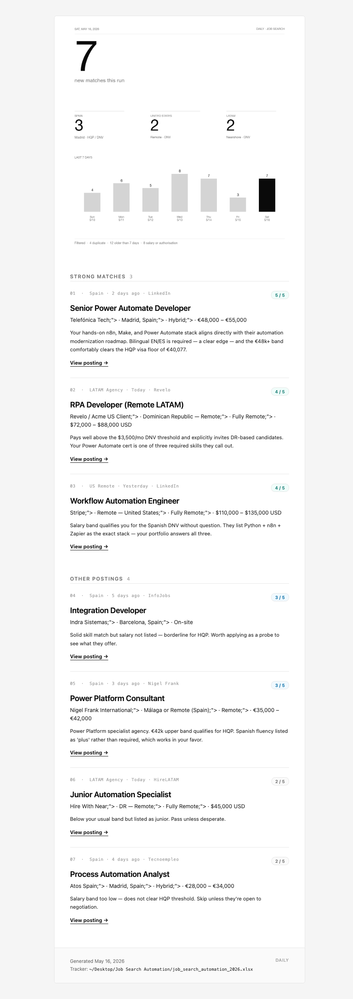

# job-search-automation

[](https://github.com/dominicci13/job-search-automation/actions/workflows/ci.yml)
[](https://www.python.org/downloads/)
[](LICENSE)

An end-to-end Python automation that runs an LLM agent 3× daily, searches 4 job
markets, deduplicates results, tailors per-role resumes, maintains an Excel
tracker, and delivers a polished HTML email digest — all running locally on
macOS with zero external infrastructure.



---

## What it does

Every weekday at 6 AM, 12 PM, and 6 PM, the automation:

1. **Wakes the Mac** via `pmset` and prevents sleep with `caffeinate`
2. **Extracts LinkedIn job URLs** from your inbox alert emails
3. **Spawns an LLM agent** (Claude CLI) that searches Indeed, LinkedIn,
   InfoJobs, Tecnoempleo, Nigel Frank, Revelo, HireLATAM, and other boards
4. **Applies hard filters** (recency ≤ 7 days, salary thresholds by market)
5. **Scores each match** 1–5 against your target stack
6. **Generates a tailored DOCX resume** per role-type (n8n / power / ai / general)
7. **Updates a 29-column Excel tracker** with formulas + color-coded markets
8. **Sends a daily HTML email** with a custom matplotlib-rendered masthead

A separate Friday-evening workflow sends a **weekly digest** summarizing
applications, status pipeline, follow-up reminders, and a 4-week trend chart.

---

## Architecture

```
launchd ──► run_job_search.sh ──► extract_linkedin_urls.py ─┐
                │                                            │
                ▼                                            │
            Claude CLI ◄──── prompt.template.txt             │
                │   │                                        │
                │   ├──► Indeed MCP ──┐                      │
                │   ├──► WebSearch ───┼──► job listings ◄────┘
                │   └──► WebFetch ────┘
                │
                ▼
       openpyxl ──► Excel tracker
       python-docx ──► tailored resumes
                │
                ▼
       send_daily_digest.py ──► matplotlib PNG + HTML template
                │
                ▼
       Mail.app (AppleScript) ──► iCloud SMTP ──► your inbox
```

See [docs/architecture.md](docs/architecture.md) for a deeper breakdown.

---

## Stack

| Layer | Tech |
|---|---|
| Scheduler | macOS `launchd` |
| LLM agent | [Claude CLI](https://docs.claude.com/en/docs/claude-code/overview) (`claude --print`) |
| Tool integrations | MCP servers (Indeed), `WebSearch`, `WebFetch` |
| Inbox parsing | `osascript` + Mail.app `whose` predicate |
| Data | `openpyxl` (Excel), local filesystem |
| Documents | `python-docx` |
| Email design | `matplotlib` (PNG masthead) + table-based HTML |
| Email delivery | macOS Mail.app via AppleScript |

---

## Setup

> **Requirements**: macOS, Python 3.11+, Claude CLI installed and authenticated,
> Mail.app configured with your email account.

Quick start:

```bash
git clone https://github.com/dominicci13/job-search-automation.git
cd job-search-automation
cp .env.example .env                          # Fill in your paths + email
cp config/profile.example.yaml config/profile.yaml   # Fill in your profile
cp config/prompt.template.txt config/prompt.txt      # Customize the prompt
pip install -r requirements.txt
python scripts/setup_excel.py                 # Generate blank tracker
```

Then install the launchd agents (see [docs/setup.md](docs/setup.md)).

---

## Design philosophy of the email

The daily digest uses a deliberately **minimal** aesthetic — pure white
background, near-black ink, single muted accent, hairline dividers, generous
whitespace. Typography weight and scale carry the hierarchy; nothing
decorative. The visual chrome (KPIs, trend chart, market breakdown) is baked
into a single matplotlib-rendered PNG so iOS Mail's dark-mode auto-conversion
can't disturb the layout.

A `<meta name="color-scheme" content="light only">` directive disables
dark-mode inversion on Apple Mail, and `multipart/alternative` MIME structure
(set via `content` + `html content` in AppleScript, no attachment) ensures the
HTML body renders inline in every email client — including Outlook on iPhone,
which mis-parses any `multipart/mixed` structure as an attachment.

---

## Author

Built by **Brian Ramirez** ([@dominicci13](https://github.com/dominicci13)) — automation & AI workflow specialist. More on my [GitHub profile](https://github.com/dominicci13) and [LinkedIn](https://linkedin.com/in/bdramirez).

## License

MIT — see [LICENSE](LICENSE).
